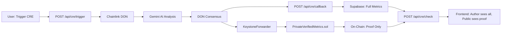

## Overview

**PrivateVerifiedMetrics** stores Chainlink CRE-attested story quality metrics with **privacy-first design**:

- **Minimal On-Chain Data**: Only quality tier (1-5), threshold boolean, and cryptographic hashes
- **Full Metrics Off-Chain**: Complete scores, themes, and word count stored in Supabase (author-only access)
- **Verifiable Compute**: Chainlink DON nodes run Gemini AI analysis in a trusted execution environment
- **Zero-Knowledge Proof**: Author commitment hash prevents address exposure
- **Dual-Write Architecture**: On-chain attestation + off-chain storage for best of both worlds

### Contract Address

<CodeGroup>
```typescript Address
const VERIFIED_METRICS_ADDRESS = "0x158e08BCD918070C1703E8b84a6E2524D2AE5e4c";
```

```bash Base Sepolia Explorer
https://sepolia.basescan.org/address/0x158e08BCD918070C1703E8b84a6E2524D2AE5e4c
```
</CodeGroup>

<Note>
**Legacy Contract**: The old `VerifiedMetrics` contract (`0x052B52A4...`) stored full metrics on-chain. It remains deployed for backward compatibility but is deprecated.
</Note>

## Architecture



### Privacy Model

| Data Type | On-Chain | Off-Chain (Supabase) |
|-----------|----------|----------------------|
| Story ID | ✅ (bytes32 hash) | ✅ |
| Author Address | ❌ (commitment hash only) | ✅ |
| Quality Tier | ✅ (1-5) | ✅ |
| Threshold Pass | ✅ (boolean) | ✅ |
| Quality Score | ❌ | ✅ (author-only) |
| Coherence Score | ❌ | ✅ (author-only) |
| Depth Score | ❌ | ✅ (author-only) |
| Themes | ❌ | ✅ (author-only) |
| Word Count | ❌ | ✅ (author-only) |
| Metrics Hash | ✅ (keccak256) | ✅ (for verification) |
| Attestation ID | ✅ | ✅ |

## Contract Code

```solidity contracts/PrivateVerifiedMetrics.sol
// SPDX-License-Identifier: MIT
pragma solidity ^0.8.20;

import {ReceiverTemplate} from "./interfaces/ReceiverTemplate.sol";

contract PrivateVerifiedMetrics is ReceiverTemplate {

    struct MinimalMetrics {
        bool meetsQualityThreshold;  // qualityScore >= 70
        uint8 qualityTier;           // 1-5 (ranges: 0-20, 21-40, 41-60, 61-80, 81-100)
        bytes32 metricsHash;         // keccak256(abi.encode(all scores + themes + salt))
        bytes32 authorCommitment;    // keccak256(abi.encodePacked(authorWallet, storyId))
        bytes32 attestationId;
        uint256 verifiedAt;
        bool exists;
    }

    mapping(bytes32 => MinimalMetrics) public metrics;

    event MetricsVerified(
        bytes32 indexed storyId,
        bytes32 indexed authorCommitment,
        uint8 qualityTier,
        bool meetsQualityThreshold
    );

    constructor(address _forwarderAddress) ReceiverTemplate(_forwarderAddress) {}

    function _processReport(bytes calldata report) internal override {
        (
            bytes32 storyId,
            bytes32 authorCommitment,
            bool meetsQualityThreshold,
            uint8 qualityTier,
            bytes32 metricsHash,
            bytes32 attestationId
        ) = abi.decode(
            report,
            (bytes32, bytes32, bool, uint8, bytes32, bytes32)
        );

        require(qualityTier >= 1 && qualityTier <= 5, "Quality tier out of range");

        metrics[storyId] = MinimalMetrics({
            meetsQualityThreshold: meetsQualityThreshold,
            qualityTier: qualityTier,
            metricsHash: metricsHash,
            authorCommitment: authorCommitment,
            attestationId: attestationId,
            verifiedAt: block.timestamp,
            exists: true
        });

        emit MetricsVerified(storyId, authorCommitment, qualityTier, meetsQualityThreshold);
    }

    function getMetrics(bytes32 storyId) external view returns (
        bool meetsQualityThreshold,
        uint8 qualityTier,
        bytes32 metricsHash,
        bytes32 authorCommitment,
        bytes32 attestationId,
        uint256 verifiedAt
    ) {
        require(metrics[storyId].exists, "Not verified");
        MinimalMetrics storage m = metrics[storyId];
        return (m.meetsQualityThreshold, m.qualityTier, m.metricsHash, m.authorCommitment, m.attestationId, m.verifiedAt);
    }

    function isVerified(bytes32 storyId) external view returns (bool) {
        return metrics[storyId].exists;
    }

    function verifyAuthor(bytes32 storyId, address author) external view returns (bool) {
        if (!metrics[storyId].exists) return false;
        bytes32 computed = keccak256(abi.encodePacked(author, storyId));
        return computed == metrics[storyId].authorCommitment;
    }

    function verifyMetricsHash(bytes32 storyId, bytes32 hash) external view returns (bool) {
        if (!metrics[storyId].exists) return false;
        return hash == metrics[storyId].metricsHash;
    }
}
```

## Functions

### onReport (CRE Receiver)

Called by Chainlink KeystoneForwarder to deliver CRE report.

```solidity
function onReport(bytes calldata metadata, bytes calldata report) external
```

<ParamField path="metadata" type="bytes">
  ABI-encoded workflow identity: `(bytes32 workflowId, bytes10 workflowName, address workflowOwner)`
</ParamField>

<ParamField path="report" type="bytes">
  ABI-encoded minimal metrics: `(bytes32 storyId, bytes32 authorCommitment, bool meetsQualityThreshold, uint8 qualityTier, bytes32 metricsHash, bytes32 attestationId)`
</ParamField>

<Warning>
**Access Control**: Only callable by the trusted KeystoneForwarder address:

```solidity
Base Sepolia KeystoneForwarder: 0x82300bd7c3958625581cc2f77bc6464dcecdf3e5
```

Reverts if caller is not the forwarder.
</Warning>

### getMetrics

Retrieve minimal on-chain metrics for a story.

```solidity
function getMetrics(bytes32 storyId) external view returns (
    bool meetsQualityThreshold,
    uint8 qualityTier,
    bytes32 metricsHash,
    bytes32 authorCommitment,
    bytes32 attestationId,
    uint256 verifiedAt
)
```

<ParamField path="storyId" type="bytes32" required>
  Keccak256 hash of story ID (e.g., `keccak256(abi.encodePacked(storyId))`)
</ParamField>

<ResponseField name="meetsQualityThreshold" type="bool">
  True if quality score >= 70
</ResponseField>

<ResponseField name="qualityTier" type="uint8">
  1-5 tier:
  - Tier 1: 0-20
  - Tier 2: 21-40
  - Tier 3: 41-60
  - Tier 4: 61-80
  - Tier 5: 81-100
</ResponseField>

<ResponseField name="metricsHash" type="bytes32">
  Keccak256 hash of full metrics (proof of integrity)
</ResponseField>

<ResponseField name="authorCommitment" type="bytes32">
  Keccak256 hash of (author address + story ID). Prevents address leakage.
</ResponseField>

<ResponseField name="attestationId" type="bytes32">
  Unique CRE attestation identifier
</ResponseField>

<ResponseField name="verifiedAt" type="uint256">
  Block timestamp when metrics were verified
</ResponseField>

### isVerified

Check if a story has been verified.

```solidity
function isVerified(bytes32 storyId) external view returns (bool)
```

<ParamField path="storyId" type="bytes32" required>
  Story ID hash
</ParamField>

<ResponseField name="verified" type="bool">
  True if CRE report has been processed for this story
</ResponseField>

### verifyAuthor

Prove story authorship without exposing the author's address.

```solidity
function verifyAuthor(bytes32 storyId, address author) external view returns (bool)
```

<ParamField path="storyId" type="bytes32" required>
  Story ID hash
</ParamField>

<ParamField path="author" type="address" required>
  Claimed author address
</ParamField>

<ResponseField name="isAuthor" type="bool">
  True if `keccak256(abi.encodePacked(author, storyId)) == authorCommitment`
</ResponseField>

<Note>
**Zero-Knowledge Proof Pattern**:

The contract stores `authorCommitment = keccak256(author + storyId)` instead of the raw author address. This allows:
- Author can prove ownership by providing their address
- Third parties cannot reverse the hash to find the author
- Privacy-preserving verification
</Note>

### verifyMetricsHash

Prove full metrics integrity.

```solidity
function verifyMetricsHash(bytes32 storyId, bytes32 hash) external view returns (bool)
```

<ParamField path="storyId" type="bytes32" required>
  Story ID hash
</ParamField>

<ParamField path="hash" type="bytes32" required>
  Keccak256 hash computed from full metrics
</ParamField>

<ResponseField name="isValid" type="bool">
  True if provided hash matches on-chain `metricsHash`
</ResponseField>

<Note>
**Use Case**: Author can prove to a third party that their off-chain metrics are authentic by:

1. Sharing full metrics + salt off-chain
2. Third party computes `keccak256(abi.encode(metrics, salt))`
3. Third party calls `verifyMetricsHash(storyId, computedHash)`
4. Contract returns true if hashes match

This enables **verifiable claims** without revealing raw data on-chain.
</Note>

## Events

### MetricsVerified

```solidity
event MetricsVerified(
    bytes32 indexed storyId,
    bytes32 indexed authorCommitment,
    uint8 qualityTier,
    bool meetsQualityThreshold
);
```

Emitted when CRE report is processed.

<ResponseField name="storyId" type="bytes32">
  Story ID hash
</ResponseField>

<ResponseField name="authorCommitment" type="bytes32">
  Author commitment hash (not raw address)
</ResponseField>

<ResponseField name="qualityTier" type="uint8">
  1-5 tier
</ResponseField>

<ResponseField name="meetsQualityThreshold" type="bool">
  True if quality >= 70
</ResponseField>

## CRE Workflow Integration

### Trigger CRE Analysis

```typescript app/api/cre/trigger/route.ts
import { NextRequest, NextResponse } from 'next/server';
import { validateAuthOrReject, isAuthError } from '@/lib/auth';

export async function POST(req: NextRequest) {
  const authResult = await validateAuthOrReject(req);
  if (isAuthError(authResult)) return authResult;
  const userId = authResult;

  const { storyId, text, authorWallet } = await req.json();

  // Call Chainlink CRE workflow
  const response = await fetch(process.env.CRE_WORKFLOW_ENDPOINT!, {
    method: 'POST',
    headers: { 'Content-Type': 'application/json' },
    body: JSON.stringify({
      storyId,
      text,
      authorWallet,
      callbackUrl: `${process.env.NEXT_PUBLIC_APP_URL}/api/cre/callback`
    })
  });

  const { workflowRunId } = await response.json();

  return NextResponse.json({ success: true, workflowRunId });
}
```

### CRE Callback (Dual-Write)

```typescript app/api/cre/callback/route.ts
import { supabaseAdmin } from '@/app/utils/supabase/supabaseAdmin';

export async function POST(req: NextRequest) {
  const {
    storyId,
    authorWallet,
    qualityScore,
    coherenceScore,
    depthScore,
    themes,
    wordCount,
    meetsQualityThreshold,
    qualityTier,
    metricsHash,
    attestationId
  } = await req.json();

  // Store FULL metrics in Supabase (author-only access via RLS)
  await supabaseAdmin.from('verified_metrics').insert({
    story_id: storyId,
    author_wallet: authorWallet,
    quality_score: qualityScore,
    coherence_score: coherenceScore,
    depth_score: depthScore,
    themes: themes,
    word_count: wordCount,
    meets_quality_threshold: meetsQualityThreshold,
    quality_tier: qualityTier,
    metrics_hash: metricsHash,
    attestation_id: attestationId,
    verified_at: new Date().toISOString()
  });

  // CRE workflow sends minimal data to KeystoneForwarder → PrivateVerifiedMetrics.sol
  // (handled by Chainlink DON, not by this callback)

  return NextResponse.json({ success: true });
}
```

### Read Metrics (Author-Filtered)

```typescript app/api/cre/check/route.ts
import { publicClient } from '@/lib/wagmi';
import { VERIFIED_METRICS_ABI, VERIFIED_METRICS_ADDRESS } from '@/lib/contracts';
import { supabaseAdmin } from '@/app/utils/supabase/supabaseAdmin';
import { keccak256, encodePacked } from 'viem';

export async function GET(req: NextRequest) {
  const { searchParams } = new URL(req.url);
  const storyId = searchParams.get('storyId');
  const requesterAddress = searchParams.get('address'); // Optional

  const storyIdHash = keccak256(encodePacked(['string'], [storyId]));

  // 1. Get on-chain proof
  const onChainMetrics = await publicClient.readContract({
    address: VERIFIED_METRICS_ADDRESS,
    abi: VERIFIED_METRICS_ABI,
    functionName: 'getMetrics',
    args: [storyIdHash]
  });

  // 2. Verify authorship (if requester provided address)
  let isAuthor = false;
  if (requesterAddress) {
    isAuthor = await publicClient.readContract({
      address: VERIFIED_METRICS_ADDRESS,
      abi: VERIFIED_METRICS_ABI,
      functionName: 'verifyAuthor',
      args: [storyIdHash, requesterAddress]
    });
  }

  // 3. If author, return full metrics from Supabase
  if (isAuthor) {
    const { data: fullMetrics } = await supabaseAdmin
      .from('verified_metrics')
      .select('*')
      .eq('story_id', storyId)
      .single();

    return NextResponse.json({
      success: true,
      isAuthor: true,
      onChainProof: onChainMetrics,
      fullMetrics: fullMetrics
    });
  }

  // 4. If not author, return only on-chain proof
  return NextResponse.json({
    success: true,
    isAuthor: false,
    onChainProof: onChainMetrics,
    fullMetrics: null // Privacy: no access to raw scores/themes
  });
}
```

## Usage Examples

### Trigger Verification

```typescript components/StoryMetrics.tsx
import { useState } from 'react';
import { useAccount } from 'wagmi';

function StoryMetrics({ storyId, text }: { storyId: string; text: string }) {
  const { address } = useAccount();
  const [isVerifying, setIsVerifying] = useState(false);

  async function triggerVerification() {
    setIsVerifying(true);

    const response = await fetch('/api/cre/trigger', {
      method: 'POST',
      headers: {
        'Content-Type': 'application/json',
        'Authorization': `Bearer ${localStorage.getItem('supabase_token')}`
      },
      body: JSON.stringify({
        storyId,
        text,
        authorWallet: address
      })
    });

    const { workflowRunId } = await response.json();

    // Poll for completion
    const intervalId = setInterval(async () => {
      const checkResponse = await fetch(`/api/cre/check?storyId=${storyId}&address=${address}`);
      const { success, onChainProof } = await checkResponse.json();

      if (success && onChainProof) {
        clearInterval(intervalId);
        setIsVerifying(false);
        toast.success('Story verified!');
      }
    }, 5000);
  }

  return (
    <button onClick={triggerVerification} disabled={isVerifying}>
      {isVerifying ? 'Verifying...' : 'Verify Quality'}
    </button>
  );
}
```

### Display Verified Badge

```typescript components/VerifiedBadge.tsx
import { useVerifiedMetrics } from '@/app/hooks/useVerifiedMetrics';
import { CheckCircle } from 'lucide-react';

function VerifiedBadge({ storyId }: { storyId: string }) {
  const { metrics, isAuthor, isLoading } = useVerifiedMetrics(storyId);

  if (isLoading) return <div>Checking...</div>;
  if (!metrics) return null;

  return (
    <div className="flex items-center gap-2">
      <CheckCircle className="text-green-500" />
      <span>Verified: Tier {metrics.qualityTier}</span>
      {isAuthor && (
        <span>Quality Score: {metrics.fullMetrics?.qualityScore}/100</span>
      )}
    </div>
  );
}
```

### Check Verification Status

```typescript Read Contract
import { useReadContract } from 'wagmi';
import { VERIFIED_METRICS_ABI, VERIFIED_METRICS_ADDRESS } from '@/lib/contracts';
import { keccak256, encodePacked } from 'viem';

const storyId = "story-123";
const storyIdHash = keccak256(encodePacked(['string'], [storyId]));

const { data: isVerified } = useReadContract({
  address: VERIFIED_METRICS_ADDRESS,
  abi: VERIFIED_METRICS_ABI,
  functionName: 'isVerified',
  args: [storyIdHash]
});

if (isVerified) {
  console.log('Story has been verified by CRE!');
}
```

## Privacy Guarantees

<AccordionGroup>
  <Accordion title="Author Privacy">
    **Problem**: Storing author addresses on-chain enables:
    - Address tracking across all verified stories
    - Profiling user writing habits
    - Linking pseudonymous identities
    
    **Solution**: `authorCommitment = keccak256(author + storyId)`
    - Only author can prove ownership by providing their address
    - Third parties cannot reverse-engineer the author
    - Each story has a unique commitment (no cross-story linking)
  </Accordion>
  
  <Accordion title="Metrics Privacy">
    **Problem**: On-chain storage of full AI analysis reveals:
    - Exact quality scores (embarrassing for low-quality stories)
    - Detected themes (potentially sensitive topics)
    - Word counts (reveals writing effort)
    
    **Solution**: Store only tier + threshold + hash on-chain
    - Public can see "Tier 4" but not "73/100"
    - Full metrics stored in Supabase with RLS (author-only access)
    - `metricsHash` enables verifiable off-chain sharing
  </Accordion>
  
  <Accordion title="Verifiable Claims">
    **Use Case**: Author wants to prove story quality to a publisher without revealing raw scores publicly.
    
    **Flow**:
    1. Author shares full metrics + salt privately with publisher
    2. Publisher computes `hash = keccak256(abi.encode(metrics, salt))`
    3. Publisher calls `verifyMetricsHash(storyId, hash)`
    4. Contract confirms hash matches → metrics are authentic
    5. Publisher trusts scores without on-chain exposure
  </Accordion>
</AccordionGroup>

## Security Considerations

<Warning>
**KeystoneForwarder Trust**:

PrivateVerifiedMetrics inherits from `ReceiverTemplate`, which validates:

```solidity
require(msg.sender == s_forwarderAddress, "InvalidSender");
```

Only the Chainlink KeystoneForwarder can call `onReport()`. This prevents:
- Fake metrics injection
- Replay attacks
- Unauthorized updates

**Forwarder Address**: `0x82300bd7c3958625581cc2f77bc6464dcecdf3e5` (Base Sepolia)
</Warning>

<Note>
**Hash Collisions**:

`keccak256` has a 2^256 output space, making collisions computationally infeasible. However:

- **Salt**: Always include a random salt when computing `metricsHash` to prevent rainbow table attacks
- **Uniqueness**: Story IDs should be globally unique (use UUID or `${userId}_${timestamp}`)

**Best Practice**:
```typescript
const salt = crypto.randomUUID();
const metricsHash = keccak256(
  encodePacked(
    ['uint256', 'uint256', 'uint256', 'string[]', 'uint256', 'bytes32'],
    [qualityScore, coherenceScore, depthScore, themes, wordCount, salt]
  )
);
```
</Note>

## Gas Costs

Typical gas costs on Base Sepolia:

| Function | Gas Used | Cost @ 0.1 gwei |
|----------|----------|------------------|
| `onReport()` | ~80,000 | ~0.000008 ETH |
| `getMetrics()` | ~25,000 | ~0.0000025 ETH |
| `isVerified()` | ~5,000 | ~0.0000005 ETH |
| `verifyAuthor()` | ~30,000 | ~0.000003 ETH |

<Note>
**Gas Savings vs Legacy**:

Old `VerifiedMetrics` contract stored full metrics on-chain:
- Quality, coherence, depth scores (3x uint256)
- Themes array (dynamic string[])
- ~200,000 gas per report

New `PrivateVerifiedMetrics` stores only hashes:
- 4x bytes32 + 1x uint8 + 1x bool + 1x uint256
- ~80,000 gas per report
- **60% gas reduction**
</Note>

## ABI Reference

```typescript lib/contracts.ts
export const VERIFIED_METRICS_ABI = [
  "function onReport(bytes calldata metadata, bytes calldata report)",
  "function getMetrics(bytes32 storyId) view returns (bool meetsQualityThreshold, uint8 qualityTier, bytes32 metricsHash, bytes32 authorCommitment, bytes32 attestationId, uint256 verifiedAt)",
  "function isVerified(bytes32 storyId) view returns (bool)",
  "function getAttestationId(bytes32 storyId) view returns (bytes32)",
  "function verifyAuthor(bytes32 storyId, address author) view returns (bool)",
  "function verifyMetricsHash(bytes32 storyId, bytes32 hash) view returns (bool)",
  "function supportsInterface(bytes4 interfaceId) view returns (bool)",
  "event MetricsVerified(bytes32 indexed storyId, bytes32 indexed authorCommitment, uint8 qualityTier, bool meetsQualityThreshold)"
] as const;
```

## Next Steps

<CardGroup cols={2}>
  <Card title="CRE Integration" icon="brain" href="/architecture/cre-integration">
    Learn Chainlink CRE SDK patterns for building workflows
  </Card>
  <Card title="Cognitive Insights" icon="code" href="/features/cognitive-insights">
    React hook for reading verified metrics
  </Card>
</CardGroup>