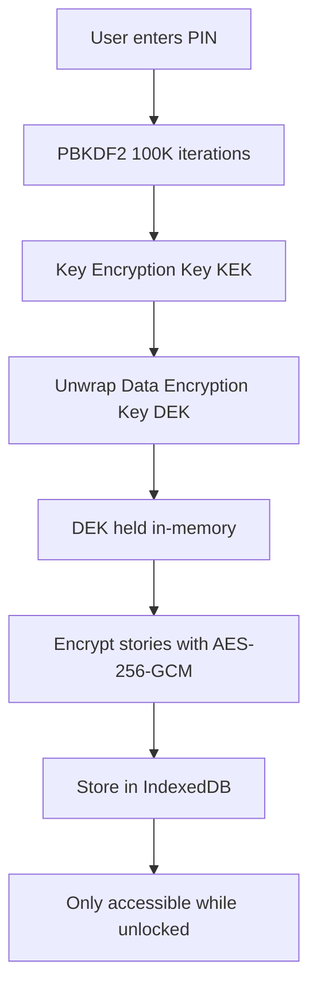
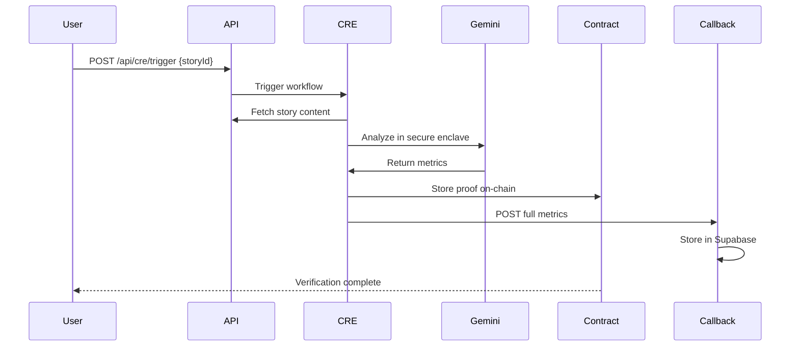

<Note>
  iStory combines **voice-first journaling** with **AI-powered insights** and **blockchain permanence** to create a sovereign memory infrastructure.
</Note>

## Core Features

<CardGroup cols={2}>
  <Card title="Voice-to-Text" icon="microphone" color="#8B5CF6">
    Record stories naturally using browser audio capture with AI transcription
  </Card>
  <Card title="AI Insights" icon="brain" color="#8B5CF6">
    Automatic extraction of themes, emotions, and patterns from your entries
  </Card>
  <Card title="Local Vault" icon="shield" color="#8B5CF6">
    Client-side AES-256-GCM encryption with PIN-protected key management
  </Card>
  <Card title="Blockchain Verification" icon="check-circle" color="#8B5CF6">
    Chainlink CRE attestation for verifiable story quality metrics
  </Card>
  <Card title="Pattern Discovery" icon="sparkles" color="#8B5CF6">
    AI aggregates themes and domains across all your stories over time
  </Card>
  <Card title="Social Sharing" icon="users" color="#8B5CF6">
    Share stories publicly, earn tokens from engagement, and build community
  </Card>
  <Card title="NFT Compilation" icon="book-open" color="#8B5CF6">
    Compile stories into digital books and mint as ERC721 NFTs on Base
  </Card>
  <Card title="Web3 Native" icon="wallet" color="#8B5CF6">
    Dual auth (Google + Wallet), token rewards, and smart contract integration
  </Card>
</CardGroup>

---

## 1. Voice-to-Text Journaling

### How It Works

iStory uses **ElevenLabs Scribe** for high-accuracy speech-to-text transcription:

```typescript app/api/ai/transcribe/route.ts
export async function POST(request: NextRequest) {
  // 1. Validate auth and file size
  const authenticatedUserId = await validateAuthOrReject(request);
  const formData = await request.formData();
  const audioFile = formData.get('audio') as File;
  
  if (audioFile.size > 25_000_000) {
    return NextResponse.json({ error: 'File too large' }, { status: 400 });
  }

  // 2. Convert to FormData for ElevenLabs
  const elevenlabsFormData = new FormData();
  elevenlabsFormData.append('audio', audioFile);
  elevenlabsFormData.append('model_id', 'scribe-v1');

  // 3. Call ElevenLabs Scribe API
  const response = await fetch(
    'https://api.elevenlabs.io/v1/scribe',
    {
      method: 'POST',
      headers: { 'xi-api-key': process.env.ELEVENLABS_API_KEY! },
      body: elevenlabsFormData,
    }
  );

  const data = await response.json();
  return NextResponse.json({ text: data.text });
}
```

<Tabs>
  <Tab title="Browser Recording">
    ```typescript
    const stream = await navigator.mediaDevices.getUserMedia({
      audio: {
        echoCancellation: true,
        noiseSuppression: true,
        sampleRate: 16000,
      },
    });

    const mediaRecorder = new MediaRecorder(stream);
    const audioChunks: Blob[] = [];

    mediaRecorder.ondataavailable = (e) => {
      audioChunks.push(e.data);
    };

    mediaRecorder.onstop = () => {
      const audioBlob = new Blob(audioChunks, { type: 'audio/webm' });
      transcribeAudio(audioBlob);
    };

    mediaRecorder.start();
    ```
  </Tab>
  <Tab title="API Request">
    ```typescript
    const formData = new FormData();
    formData.append('audio', audioBlob, 'recording.webm');

    const response = await fetch('/api/ai/transcribe', {
      method: 'POST',
      headers: { Authorization: `Bearer ${token}` },
      body: formData,
    });

    const { text } = await response.json();
    ```
  </Tab>
  <Tab title="Response">
    ```json
    {
      "text": "I've been thinking a lot about personal growth lately. The conversations I had this week made me realize how much I've changed over the past year. I'm more intentional about my time and energy now."
    }
    ```
  </Tab>
</Tabs>

### Audio Storage

Recorded audio is uploaded to **Supabase Storage** and linked to your story:

```typescript
const uploadAudio = async (audioBlob: Blob) => {
  const filename = `${Date.now()}-${Math.random().toString(36)}.webm`;
  const { data, error } = await supabase.storage
    .from('story-audio')
    .upload(`public/${filename}`, audioBlob);

  const { data: { publicUrl } } = supabase.storage
    .from('story-audio')
    .getPublicUrl(data.path);

  return publicUrl;
};
```

<Info>
  **Audio files** are stored indefinitely and can be played back from the Library or Story detail page.
</Info>

---

## 2. AI Enhancement & Analysis

### Text Enhancement

Use **Google Gemini 2.5 Flash** to polish your writing:

```typescript app/api/ai/enhance/route.ts
export async function POST(request: NextRequest) {
  const { text } = await request.json();
  
  const model = genAI.getGenerativeModel({ model: 'gemini-2.0-flash-exp' });
  const prompt = `
You are a writing assistant. Improve the following journal entry:
- Fix grammar and spelling
- Improve clarity and flow
- Maintain the author's voice and intent
- Keep the same length

Original text:
${text}

Improved version:`;

  const result = await model.generateContent(prompt);
  const enhanced = result.response.text();
  
  return NextResponse.json({ text: enhanced });
}
```

### Story Analysis

**Cognitive metadata extraction** happens automatically after saving:

```typescript app/api/ai/analyze/route.ts
export async function POST(request: NextRequest) {
  const { storyId, storyText } = await request.json();
  
  // Verify ownership
  const story = await admin.from('stories').select('*').eq('id', storyId).single();
  if (story.data.author_id !== authenticatedUserId) {
    return NextResponse.json({ error: 'Unauthorized' }, { status: 403 });
  }

  const model = genAI.getGenerativeModel({ model: 'gemini-2.0-flash-exp' });
  const analysisPrompt = `
Analyze this journal entry and extract:
1. Main themes (max 5 keywords)
2. Emotional tone (one word: hopeful, reflective, anxious, etc.)
3. Life domain (relationships, work, health, personal_growth, etc.)
4. Significance score (0-10)
5. Key entities (people, places, times mentioned)

Story:
${storyText}

Return JSON only.`;

  const result = await model.generateContent(analysisPrompt);
  const metadata = JSON.parse(result.response.text());

  // Save to database
  await admin.from('story_metadata').upsert({
    story_id: storyId,
    themes: metadata.themes,
    emotional_tone: metadata.emotional_tone,
    life_domain: metadata.life_domain,
    significance_score: metadata.significance_score,
    entities: metadata.entities,
    word_count: storyText.split(/\s+/).length,
  });

  return NextResponse.json({ success: true, metadata });
}
```

<CodeGroup>
```json Example Metadata Output
{
  "themes": ["self-reflection", "change", "intentionality", "growth"],
  "emotional_tone": "contemplative",
  "life_domain": "personal_growth",
  "significance_score": 8.2,
  "entities": {
    "people": [],
    "places": [],
    "times": ["this week", "past year"]
  },
  "word_count": 58,
  "reading_time_minutes": 1
}
```

```typescript Display Insights
import { StoryInsights } from '@/components/StoryInsights';

<StoryInsights 
  storyId={story.id} 
  storyText={story.content} 
/>
```
</CodeGroup>

---

## 3. Local Vault Encryption

**Client-side encryption** using the Web Crypto API for maximum privacy:

### Architecture



### Implementation

<Tabs>
  <Tab title="Setup Vault">
    ```typescript lib/vault/keyManager.ts
    export async function setupVault(pin: string): Promise<void> {
      // 1. Generate Data Encryption Key (DEK)
      const dek = await crypto.subtle.generateKey(
        { name: 'AES-GCM', length: 256 },
        true,
        ['encrypt', 'decrypt']
      );

      // 2. Derive Key Encryption Key (KEK) from PIN
      const salt = crypto.getRandomValues(new Uint8Array(16));
      const pinKey = await crypto.subtle.importKey(
        'raw',
        new TextEncoder().encode(pin),
        'PBKDF2',
        false,
        ['deriveKey']
      );

      const kek = await crypto.subtle.deriveKey(
        { name: 'PBKDF2', salt, iterations: 100_000, hash: 'SHA-256' },
        pinKey,
        { name: 'AES-KW', length: 256 },
        false,
        ['wrapKey', 'unwrapKey']
      );

      // 3. Wrap DEK with KEK
      const wrappedDek = await crypto.subtle.wrapKey('raw', dek, kek, 'AES-KW');

      // 4. Store salt + wrapped DEK in IndexedDB
      await db.vault_metadata.put({
        id: 1,
        salt: Array.from(salt),
        wrapped_dek: Array.from(new Uint8Array(wrappedDek)),
        created_at: Date.now(),
      });

      // 5. Hold DEK in-memory
      inMemoryKeys.set('dek', dek);
    }
    ```
  </Tab>
  <Tab title="Encrypt Story">
    ```typescript lib/vault/crypto.ts
    export async function encryptString(plaintext: string): Promise<string> {
      const dek = getDEK();
      if (!dek) throw new Error('Vault is locked');

      const iv = crypto.getRandomValues(new Uint8Array(12));
      const encoded = new TextEncoder().encode(plaintext);

      const ciphertext = await crypto.subtle.encrypt(
        { name: 'AES-GCM', iv },
        dek,
        encoded
      );

      // Prepend IV to ciphertext
      const combined = new Uint8Array(iv.length + ciphertext.byteLength);
      combined.set(iv, 0);
      combined.set(new Uint8Array(ciphertext), iv.length);

      return btoa(String.fromCharCode(...combined));
    }
    ```
  </Tab>
  <Tab title="Usage">
    ```typescript
    import { useLocalStories } from '@/app/hooks/useLocalStories';

    function MyComponent() {
      const { stories, addStory, isUnlocked } = useLocalStories();

      const saveLocal = async () => {
        if (!isUnlocked) {
          toast.error('Vault is locked');
          return;
        }

        await addStory({
          title: 'My Private Thought',
          content: 'This is encrypted at rest',
          created_at: Date.now(),
        });
      };

      return (
        <div>
          {stories.map(s => (
            <div key={s.id}>{s.title}</div>
          ))}
        </div>
      );
    }
    ```
  </Tab>
</Tabs>

<Warning>
  **PIN is never stored.** If you lose your PIN, encrypted data cannot be recovered. Always back up important stories to the cloud.
</Warning>

---

## 4. Chainlink CRE Verification

**Privacy-preserving blockchain attestation** using Chainlink Compute Runtime Environment:

### How It Works



### Workflow Implementation

```typescript cre/iStory_workflow/main.ts
import { Runner, Step, WorkflowContext } from '@chainlink/cre';
import { ConfidentialHTTPClient } from '@chainlink/cre/http';
import { analyzeStory } from './gemini';
import { httpCallback } from './httpCallback';

const workflow = new Runner({
  name: 'iStory_workflow',
  version: '1.0.0',
  steps: [
    new Step({
      id: 'fetch-story',
      handler: async (ctx: WorkflowContext) => {
        const { storyId } = ctx.input;
        const response = await fetch(`${ctx.env.APP_URL}/api/stories/${storyId}`);
        const story = await response.json();
        return { story };
      },
    }),
    new Step({
      id: 'analyze',
      handler: async (ctx: WorkflowContext) => {
        const { story } = ctx.state;
        const metrics = await analyzeStory(story.content, ctx.secrets.GOOGLE_API_KEY);
        return { metrics };
      },
    }),
    new Step({
      id: 'callback',
      handler: async (ctx: WorkflowContext) => {
        await httpCallback(ctx.input.storyId, ctx.state.metrics, ctx.env.CALLBACK_SECRET);
        return { success: true };
      },
    }),
  ],
});

export default workflow;
```

### On-Chain Storage (Privacy-Preserving)

```solidity contracts/PrivateVerifiedMetrics.sol
contract PrivateVerifiedMetrics is IReceiver, AccessControl {
    struct StoryProof {
        uint8 qualityTier;        // 1-5 (only tier, not raw score)
        bool meetsThreshold;       // true if score >= 6.0
        bytes32 contentHash;       // SHA256 of story content
        bytes32 metadataHash;      // SHA256 of full metrics JSON
        uint256 timestamp;
        bool verified;
    }

    mapping(string => StoryProof) public storyProofs;

    function onReport(bytes memory rawReport) external override {
        // Decode CRE report
        (string memory storyId, StoryProof memory proof) = abi.decode(
            rawReport, 
            (string, StoryProof)
        );

        storyProofs[storyId] = proof;
        emit StoryVerified(storyId, proof.qualityTier, proof.meetsThreshold);
    }
}
```

<Info>
  **Privacy model:** Only minimal proof data (tier, threshold, hashes) is stored on-chain. Full metrics remain in Supabase, accessible only to the story author.
</Info>

### Check Verification Status

```typescript app/hooks/useVerifiedMetrics.ts
export function useVerifiedMetrics(storyId: string) {
  const [metrics, setMetrics] = useState(null);
  const [proof, setProof] = useState(null);

  useEffect(() => {
    const check = async () => {
      const res = await fetch('/api/cre/check', {
        method: 'POST',
        body: JSON.stringify({ storyId }),
      });

      const data = await res.json();
      // data.isAuthor determines what you see:
      // - Author: full metrics + proof
      // - Public: proof only (tier, threshold)
      
      setMetrics(data.metrics);
      setProof(data.proof);
    };

    check();
  }, [storyId]);

  return { metrics, proof, isVerified: !!proof };
}
```

---

## 5. Pattern Discovery

**AI aggregates themes and domains** across all your stories:

```typescript app/hooks/usePatterns.ts
export function usePatterns() {
  const [patterns, setPatterns] = useState(null);

  useEffect(() => {
    const fetchPatterns = async () => {
      const { data: metadata } = await supabase
        .from('story_metadata')
        .select('themes, life_domain, emotional_tone')
        .eq('author_id', userId);

      // Aggregate themes
      const themeFreq = metadata.flatMap(m => m.themes)
        .reduce((acc, theme) => {
          acc[theme] = (acc[theme] || 0) + 1;
          return acc;
        }, {});

      // Aggregate domains
      const domainFreq = metadata.map(m => m.life_domain)
        .reduce((acc, domain) => {
          acc[domain] = (acc[domain] || 0) + 1;
          return acc;
        }, {});

      setPatterns({ themes: themeFreq, domains: domainFreq });
    };

    fetchPatterns();
  }, [userId]);

  return patterns;
}
```

<Tabs>
  <Tab title="Themes View">
    ```typescript
    import { ThemesView } from '@/components/patterns/ThemesView';

    <ThemesView patterns={patterns} />
    ```
    Displays a word cloud or bar chart of your most common themes.
  </Tab>
  <Tab title="Domains View">
    ```typescript
    import { DomainsView } from '@/components/patterns/DomainsView';

    <DomainsView patterns={patterns} />
    ```
    Shows distribution across life domains (work, relationships, health, etc.).
  </Tab>
</Tabs>

---

## 6. Social Features

### Like System

```typescript app/api/social/like/route.ts
export async function POST(request: NextRequest) {
  const { storyId } = await request.json();
  const authenticatedUserId = await validateAuthOrReject(request);

  // Check if already liked
  const { data: existing } = await admin
    .from('likes')
    .select('*')
    .eq('story_id', storyId)
    .eq('user_id', authenticatedUserId)
    .maybeSingle();

  if (existing) {
    // Unlike
    await admin.from('likes').delete().eq('id', existing.id);
    await admin.from('stories').update({ likes: db.raw('likes - 1') }).eq('id', storyId);
    return NextResponse.json({ liked: false });
  } else {
    // Like
    await admin.from('likes').insert({ story_id: storyId, user_id: authenticatedUserId });
    await admin.from('stories').update({ likes: db.raw('likes + 1') }).eq('id', storyId);
    return NextResponse.json({ liked: true });
  }
}
```

### Tip System

```typescript app/hooks/useStoryProtocol.ts
export function useStoryProtocol() {
  const { data: hash, writeContract } = useWriteContract();

  const tipCreator = async (to: Address, amount: bigint) => {
    return writeContract({
      address: STORY_PROTOCOL_ADDRESS,
      abi: StoryProtocolABI,
      functionName: 'tipCreator',
      args: [to, amount],
    });
  };

  return { tipCreator, hash };
}
```

<CodeGroup>
```typescript Send Tip
const { tipCreator } = useStoryProtocol();
const amount = parseEther('10'); // 10 $STORY tokens

await tipCreator(authorAddress, amount);
toast.success('Tip sent!');
```

```solidity contracts/StoryProtocol.sol
function tipCreator(address to, uint256 amount) external {
    require(amount > 0, "Amount must be positive");
    
    eStoryToken.transferFrom(msg.sender, to, amount);
    
    emit TipSent(msg.sender, to, amount);
}
```
</CodeGroup>

---

## 7. NFT Book Compilation

**Compile stories into ERC721 NFTs** on Base:

```typescript app/api/book/compile/route.ts
export async function POST(request: NextRequest) {
  const { title, description, storyIds } = await request.json();
  const authenticatedUserId = await validateAuthOrReject(request);

  // Verify all stories belong to user
  const { data: stories } = await admin
    .from('stories')
    .select('*')
    .in('id', storyIds)
    .eq('author_id', authenticatedUserId);

  if (stories.length !== storyIds.length) {
    return NextResponse.json({ error: 'Unauthorized' }, { status: 403 });
  }

  // Generate PDF
  const pdfBuffer = await generatePDF({
    title,
    stories: stories.map(s => ({ title: s.title, content: s.content })),
  });

  // Upload to IPFS
  const ipfsHash = await ipfsService.uploadFile(pdfBuffer, `${title}.pdf`);

  // Save book record
  const { data: book } = await admin.from('books').insert({
    author_id: authenticatedUserId,
    title,
    description,
    story_ids: storyIds,
    ipfs_hash: ipfsHash,
  }).select().single();

  return NextResponse.json({ success: true, book });
}
```

### Mint NFT

```typescript app/hooks/useStoryNFT.ts
export function useStoryNFT() {
  const { writeContract } = useWriteContract();

  const mintBook = async (ipfsHash: string) => {
    return writeContract({
      address: STORY_NFT_ADDRESS,
      abi: StoryNFTABI,
      functionName: 'mint',
      args: [ipfsHash],
      value: parseEther('0.001'), // Mint fee
    });
  };

  return { mintBook };
}
```

<Warning>
  **Mint fee:** 0.001 ETH per NFT to prevent spam. Fee goes to contract owner.
</Warning>

---

## 8. Web3 Integration

### Smart Contracts (Base Sepolia)

<CardGroup cols={3}>
  <Card title="eStoryToken" icon="coins">
    **ERC20** token for rewards
    - Max supply: 100M
    - Role-based minting
    - Pausable
  </Card>
  <Card title="StoryProtocol" icon="handshake">
    Tips & paywall payments
    - Token transfers
    - Event logging
  </Card>
  <Card title="StoryNFT" icon="image">
    **ERC721** book NFTs
    - Mint fee: 0.001 ETH
    - ERC2981 royalties
    - IPFS metadata
  </Card>
</CardGroup>

### Token Balance

```typescript
import { useEStoryToken } from '@/app/hooks/useIStoryToken';

function TokenBalance() {
  const { balance, symbol } = useEStoryToken();

  return (
    <div>
      {balance} {symbol}
    </div>
  );
}
```

### Transaction Example

```typescript
import { useStoryProtocol } from '@/app/hooks/useStoryProtocol';
import { parseEther } from 'viem';

const { tipCreator } = useStoryProtocol();
const { address } = useAccount();

// Send 50 $STORY tokens
const hash = await tipCreator(
  '0x742d35Cc6634C0532925a3b844Bc9e7595f0bEb',
  parseEther('50')
);

await waitForTransaction({ hash });
toast.success('Tip sent successfully!');
```

---

## API Rate Limits

All API routes are protected by rate limiting:

| Route Pattern | Limit | Window |
|---------------|-------|--------|
| `/api/ai/*` | 10 requests | 1 minute |
| `/api/auth/*` | 20 requests | 1 minute |
| `/api/cre/callback` | 30 requests | 1 minute |
| Default | 60 requests | 1 minute |

<Info>
  Rate limits are enforced via `middleware.ts` using in-memory storage.
</Info>

---

## Next Steps

<CardGroup cols={2}>
  <Card title="API Reference" icon="code" href="/api/overview">
    Explore all API endpoints and request/response formats
  </Card>
  <Card title="Vault Setup" icon="shield" href="/features/local-vault">
    Set up client-side encryption for maximum privacy
  </Card>
  <Card title="Smart Contracts" icon="file-code" href="/contracts/overview">
    Learn about token economics and NFT minting
  </Card>
  <Card title="Security" icon="lock" href="/architecture/security">
    Understand authentication, authorization, and data protection
  </Card>
</CardGroup>

<Tip>
  **Questions?** Join our [Discord community](https://discord.gg/estory) or check the [GitHub discussions](https://github.com/estory/discussions).
</Tip>