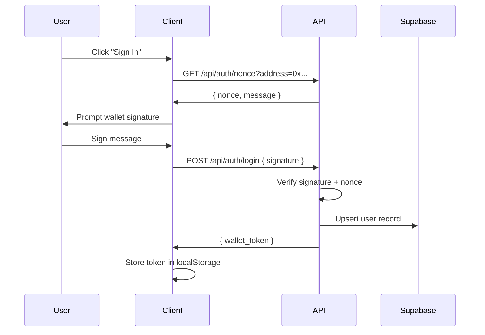
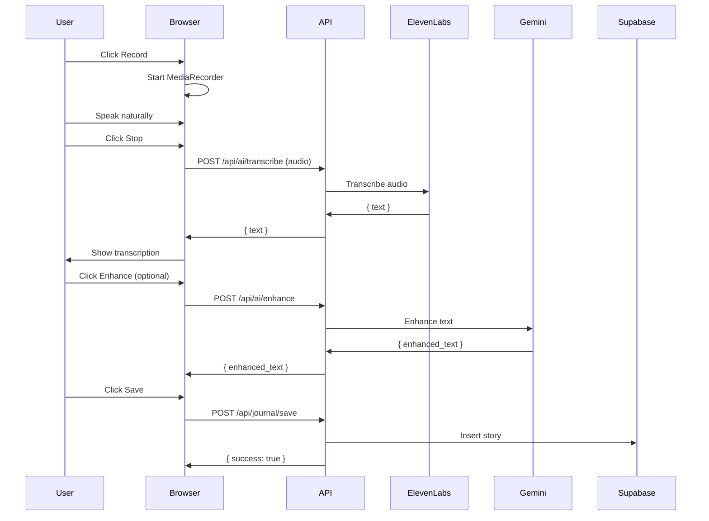

<Note>
  **New to iStory?** This guide will walk you through creating your first voice journal entry in just a few minutes.
</Note>

## What You'll Build

By the end of this guide, you'll have:
- ✅ Connected your account
- ✅ Recorded your first story using voice
- ✅ Enhanced it with AI
- ✅ Saved it permanently with encryption

<Steps>
  <Step title="Sign In to iStory">
    iStory supports two authentication methods:

    ### Option 1: Google OAuth (Recommended for beginners)
    
    Click the **"Start Journaling — Free"** button on the homepage:

    ```typescript
    // Authentication happens via Supabase
    const { signInWithGoogle } = useAuth();
    await signInWithGoogle();
    ```

    You'll be redirected to Google's OAuth consent screen. After authorization, you'll be automatically redirected back to iStory.

    ### Option 2: Web3 Wallet

    Connect your MetaMask or compatible wallet:

    ```typescript app/api/auth/nonce/route.ts
    // 1. Client fetches a nonce
    const response = await fetch(`/api/auth/nonce?address=${address}`);
    const { nonce, message } = await response.json();
    
    // 2. Sign the message containing the nonce
    const signature = await signMessageAsync({ message });
    
    // 3. Submit signature for verification
    await fetch('/api/auth/login', {
      method: 'POST',
      body: JSON.stringify({ address, signature, message })
    });
    ```

    <Info>
      **Security Note:** Wallet authentication uses server-generated nonces with 5-minute expiry to prevent signature replay attacks.
    </Info>

    After signing in, you'll see your profile info in the top right corner.
  </Step>

  <Step title="Navigate to Record Page">
    Click the **"Record New Story"** button or navigate to `/record`.

    You'll see the recording interface with:
    - 🎙️ Microphone button for voice recording
    - 📝 Text editor for transcription
    - ✨ AI enhancement tools
    - 💾 Save options

    
  </Step>

  <Step title="Record Your Story">
    ### Start Recording

    Click the microphone button to start recording:

    ```typescript app/record/RecordPageClient.tsx
    const startRecording = async () => {
      const stream = await navigator.mediaDevices.getUserMedia({
        audio: {
          echoCancellation: true,
          noiseSuppression: true,
          sampleRate: 16000,
        },
      });

      const mediaRecorder = new MediaRecorder(stream);
      mediaRecorder.start();
      setIsRecording(true);
    };
    ```

    **Just talk naturally** about:
    - Your day
    - A memory or experience
    - Something on your mind
    - A realization or insight

    The recording duration will be displayed while you speak. Click **Stop** when you're done.

    ### Transcribe Your Audio

    After stopping, your audio is automatically transcribed using ElevenLabs Scribe:

    ```typescript
    const transcribeAudio = async (audioBlob: Blob) => {
      const formData = new FormData();
      formData.append('audio', audioBlob, 'recording.webm');

      const response = await fetch('/api/ai/transcribe', {
        method: 'POST',
        headers: await getAuthHeaders(),
        body: formData,
      });

      const { text } = await response.json();
      setTranscribedText(text);
    };
    ```

    <Tip>
      **Pro tip:** You can also type directly into the text editor if you prefer writing to speaking.
    </Tip>

    ### Response Example

    ```json
    {
      "text": "Today was really interesting. I had a long conversation with my friend about the future of AI and how it might change the way we work. It made me think about what skills will be valuable in 10 years."
    }
    ```
  </Step>

  <Step title="Enhance with AI (Optional)">
    Click the **"Enhance with AI"** button to polish your text:

    ```typescript
    const enhanceText = async () => {
      const response = await fetch('/api/ai/enhance', {
        method: 'POST',
        headers: { 
          'Authorization': `Bearer ${token}`,
          'Content-Type': 'application/json' 
        },
        body: JSON.stringify({ text: transcribedText }),
      });

      const { text: enhanced } = await response.json();
      setTranscribedText(enhanced);
    };
    ```

    AI enhancement provides:
    - ✍️ Grammar and spelling corrections
    - 🎨 Improved clarity and flow
    - 💡 Better sentence structure

    <Warning>
      **Before/After is saved:** Your original text is preserved so you can undo changes if needed.
    </Warning>

    ### Before Enhancement
    ```text
    today was really interesting i had conversation with friend about ai 
    and future and it made me think about skills
    ```

    ### After Enhancement
    ```text
    Today was incredibly insightful. I had a deep conversation with a 
    friend about artificial intelligence and its implications for the 
    future. It prompted me to reflect on which skills will remain 
    valuable a decade from now.
    ```
  </Step>

  <Step title="Save Your Story">
    ### Add Metadata

    Before saving, you can add:
    - **Title** (auto-generated if blank)
    - **Mood** (happy, reflective, anxious, etc.)
    - **Tags** (topics, themes)
    - **Visibility** (public/private)
    - **Date** (can backdate entries)

    ### Click Save

    ```typescript app/api/journal/save/route.ts
    export async function POST(request: NextRequest) {
      // 1. Validate authentication
      const authenticatedUserId = await validateAuthOrReject(request);
      
      // 2. Get user's wallet address
      const { data: user } = await admin
        .from("users")
        .select("wallet_address")
        .eq("id", authenticatedUserId)
        .single();

      // 3. Insert story into database
      const { data: story } = await admin
        .from("stories")
        .insert({
          author_id: authenticatedUserId,
          author_wallet: user.wallet_address,
          title: title || `Journal Entry ${new Date().toLocaleDateString()}`,
          content,
          mood: mood || 'neutral',
          tags: tags || [],
          has_audio: !!hasAudio,
          audio_url: audioUrl || null,
        })
        .select()
        .single();

      // 4. Trigger AI analysis (background)
      fetch('/api/ai/analyze', {
        method: 'POST',
        body: JSON.stringify({ storyId: story.id, storyText: content }),
      });

      return NextResponse.json({ success: true, data: story });
    }
    ```

    <CardGroup cols={2}>
      <Card title="Cloud Storage" icon="cloud">
        Your story is saved to Supabase (PostgreSQL) with full encryption
      </Card>
      <Card title="Local Vault" icon="lock">
        Optionally encrypted client-side using AES-256-GCM in IndexedDB
      </Card>
    </CardGroup>

    ### What Happens After Save?

    1. **Story saved** to database with your author ID
    2. **AI analysis triggered** (extracts themes, emotions, entities)
    3. **Audio uploaded** to Supabase Storage (if you recorded)
    4. **Local vault copy** created (if vault is unlocked)
    5. **CRE verification** queued (blockchain attestation)

    <Info>
      **Success!** Your story is now permanently saved. You'll see a success message and can view it in your Library.
    </Info>
  </Step>

  <Step title="Explore Your Story">
    Navigate to **Library** (`/library`) to see your saved stories.

    ### View AI Insights

    Click on any story to see AI-generated insights:

    ```typescript components/StoryInsights.tsx
    const fetchMetadata = async () => {
      const res = await fetch(`/api/stories/${storyId}/metadata`);
      const { metadata } = await res.json();
      
      // metadata includes:
      // - themes: ["growth", "career", "technology"]
      // - emotional_tone: "reflective"
      // - life_domain: "professional_development"
      // - entities: { people: [], places: [], times: [] }
      // - significance_score: 7.5
      
      setMetadata(metadata);
    };
    ```

    

    ### Insights Include

    - 🧠 **Themes**: Key topics extracted from your story
    - 💭 **Emotional Tone**: Detected mood (hopeful, reflective, joyful)
    - 🏷️ **Life Domains**: Categories (relationships, work, health, etc.)
    - 👥 **Entities**: People, places, and times mentioned
    - ⭐ **Significance Score**: AI-rated importance (0-10)

    ```json Example AI Metadata
    {
      "themes": ["technology", "future-planning", "skill-development"],
      "emotional_tone": "contemplative",
      "life_domain": "professional_development",
      "entities": {
        "people": ["friend"],
        "places": [],
        "times": ["today", "10 years"]
      },
      "significance_score": 7.2,
      "word_count": 142,
      "reading_time_minutes": 1
    }
    ```
  </Step>
</Steps>

## Next Steps

<CardGroup cols={2}>
  <Card title="Explore Features" icon="compass" href="/features">
    Learn about AI patterns, vault encryption, and blockchain verification
  </Card>
  <Card title="Set Up Local Vault" icon="shield" href="/features/local-vault">
    Enable client-side encryption for maximum privacy
  </Card>
  <Card title="Share Stories" icon="share" href="/social/community-feed">
    Make stories public and engage with the community
  </Card>
  <Card title="API Reference" icon="code" href="/api/overview">
    Integrate iStory with your own applications
  </Card>
</CardGroup>

## Common Questions

<AccordionGroup>
  <Accordion title="How long does transcription take?">
    Transcription typically takes 2-5 seconds using ElevenLabs Scribe. The API processes audio at high speed with 95%+ accuracy.
  </Accordion>

  <Accordion title="Is my audio stored?">
    Yes, if you record audio, it's uploaded to Supabase Storage and linked to your story. You can play it back anytime from the Library or Story detail page.
  </Accordion>

  <Accordion title="Can I edit a story after saving?">
    Yes! Click on any story in your Library and select "Edit" to modify the title, content, mood, tags, or visibility.
  </Accordion>

  <Accordion title="What if I close the page while recording?">
    Your draft is auto-saved to sessionStorage every 500ms. If you reload the page, you'll see a "Restored unsaved draft" message.
  </Accordion>

  <Accordion title="How do I delete a story?">
    From the Library, click the three-dot menu on any story card and select "Delete". This action is permanent.
  </Accordion>
</AccordionGroup>

## Technical Details

### Authentication Flow



### Recording Flow



<Tip>
  **Ready to dive deeper?** Check out the [Features Overview](/features) to learn about AI patterns, social features, and blockchain permanence.
</Tip>